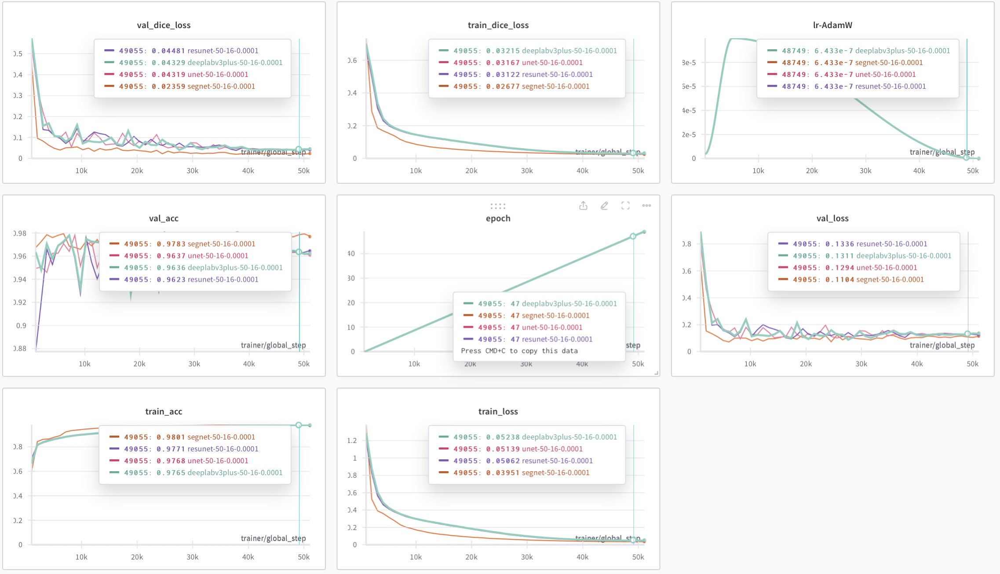

# Sign Language Detection

# Dataset
https://www.kaggle.com/datasets/awsaf49/coco-2017-dataset

## Result



## Clone

```bash
git clone https://github.com/cristiano2003/semantic-segmentation.git
cd semantic-segmentation # IF NOT ALREADY IN
```

## Setup, Build Package

```bash
source ./scripts/setup.sh
```

## Train

```bash
source ./scripts/train.sh
```


### Run Demo

```bash
python app.py
```


